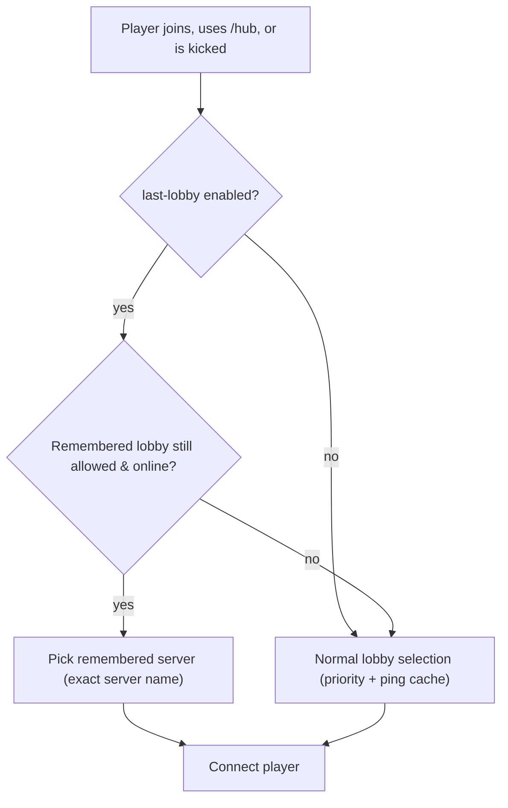

# Configuration Guide

HUB stores all settings in `plugins/hub/config.yml`. The file is written with sensible defaults on every reload, so you
can start with the generated version and tweak it to your network.

## Debug Settings

```yaml
debug:
  enabled: false
  permission: hub.debug
```

- `enabled`: Turns debug broadcasting on or off. When `true`, console and players with the configured permission receive
  verbose logging.
- `permission`: Players must hold this permission node to use `/hub debug` and to see debug broadcasts.

## Messages

`messages` contains the MiniMessage templates that are sent to players when they are transferred between servers.
`system-messages` covers error and system prompts.

You can override any of the following keys per-lobby under `lobbies[].overwrite-messages`:

- `success-message`
- `already-connected-message`
- `connection-in-progress-message`
- `server-disconnected-message`
- `connection-cancelled-message`

## Kick Message Forwarding

```yaml
kick-message:
  enabled: true
  prefix: <red>
  suffix: ''
```

- `enabled`: Forwards the original kick reason to the player (if the backend included one).
- `prefix` / `suffix`: MiniMessage snippets prepended/appended to the forwarded reason. Leave blank to keep the raw reason untouched.

## Command Settings

```yaml
base-hub-command: hub
aliases:
  - lobby
  - leave
hide-hub-command-on-lobby: ^(?!.*).$
```

- `base-hub-command`: Name of the main command.
- `aliases`: Additional command names that point to the same handler.
- `hide-hub-command-on-lobby`: Regular expression matched against the player\'s current server. If it matches, the base
  command is hidden/blocked for that player (useful if the lobby is already running `/hub`).

Each lobby defines its own `commands`:

```yaml
commands:
  premiumhub:
    standalone: true
    subcommand: true
    hide-on: ^(?!.*).$
```

- `standalone`: Registers `/premiumhub` (in this example) as a dedicated Velocity command.
- `subcommand`: Registers `/hub premiumhub`.
- `hide-on`: Reserved for future use (the value is currently only exposed through placeholders).

## Lobby Definitions

A lobby entry looks like this:

```yaml
- name: premiumlobby
  filter: (?i)^premiumlobby.*
  permission: hub.premium
  priority: 1
  commands: { ... }
  autojoin: true
  overwrite-messages:
    success-message: <#69d9ff>You are now in the <b>Premium Hub</b>.
```

- `filter`: Java regex matched against Velocity server names. Use `(?i)` for case-insensitive matching.
- `permission`: If blank, everyone is eligible. Otherwise the player must have the node.
- `priority`: Higher numbers win. The plugin checks eligible lobbies in descending order.
- `autojoin`: Informational flag, exported through placeholders.
- `parent`: Optional parent lobby or lobby-group name used when a player runs `/hub` while already inside this lobby.
- `parent-groups`: Optional list of parent lobby-group names, checked in order after `parent`.
- `overwrite-messages`: Partial set of message overrides. Omitted keys fall back to the global `messages` block.

## Lobby Groups

Lobby groups are named collections of lobby names. They are referenced by `lobbies[].parent` or
`lobbies[].parent-groups` when `/hub` is executed from inside a lobby, so you can send players "up" to a parent lobby
or a list of parent candidates.

```yaml
lobby-groups:
  - name: main
    lobbies:
      - lobby
      - teamlobby
      - premiumlobby
  - name: minigame
    lobbies:
      - ffa-lobby
```

- `name`: Group identifier used in `parent` / `parent-groups`.
- `lobbies`: Ordered list of lobby names. Missing names are skipped (a debug warning is logged when enabled).

## Last Lobby Preference

```yaml
last-lobby:
  enabled: true
```

- When enabled, HUB remembers the last lobby server a player used (in memory only). `/hub`, join auto-select, and kick redirects try that lobby first if it is online and permitted; otherwise the normal priority routing is used.
- Flow overview:



## Placeholder Toggles

Every entry beneath `placeholder` controls a set of MiniMessage placeholders. Each holder contains:

- `key`: The placeholder name.
- `example`: Example output written back to the config.
- `enabled`: Whether the placeholder is injected.
- `placeholder`: Used for indexed placeholders (e.g., `%i` for numbered keys).

The plugin exposes the following placeholders:

| Category | Key | Enabled by default | Description |
| --- | --- | --- | --- |
| Server | `server` | ✓ | Registered server name selected for the player. |
| Server | `server-host` | ✗ | Server host address. |
| Server | `server-port` | ✗ | Server port. |
| Server | `server-player-count` | ✓ | Number of tracked players on the registered server. |
| Server | `server-player-%i-username` | ✗ | Username of each player currently connected (indexed). |
| Server | `server-player-%i-uuid` | ✗ | UUID of each player currently connected (indexed). |
| Lobby | `lobby` | ✓ | Lobby name from the configuration. |
| Lobby | `lobby-filter` | ✗ | Regex used to match server names. |
| Lobby | `lobby-require-permission` | ✗ | Whether the lobby requires a permission node. |
| Lobby | `lobby-permission` | ✓ | Permission node (blank when unrestricted). |
| Lobby | `lobby-priority` | ✗ | Numerical priority used for routing. |
| Lobby | `lobby-command-%s-standalone` | ✗ | Whether each command is registered as a standalone command. |
| Lobby | `lobby-command-%s-subcommand` | ✗ | Whether each command is registered as a `/hub` subcommand. |
| Lobby | `lobby-command-%s-hide-on` | ✗ | Regex placeholder for future per-command hiding rules. |
| Lobby | `lobby-autojoin` | ✗ | Indicates the lobby\'s preferred autojoin state (informational only). |
| Player | `player` | ✓ | Player username. |
| Player | `player-uuid` | ✗ | Player UUID. |

## Finder (Ping Cache)

```yaml
finder:
  start-duration: 20
  increment-duration: 20
  max-duration: 200
  refresh-interval-in-ticks: 40
```

- `refresh-interval-in-ticks`: How often (in proxy ticks) HUB pings all servers that match a lobby filter. The actual
  interval in milliseconds is `ticks * 50`.
- `start-duration` & `max-duration`: Used as ping timeouts (in milliseconds). The code currently clamps the timeout to
  `max(start-duration, max-duration, 50)`.
- `increment-duration`: Reserved for future adaptive timeouts.

## Data Collection (Analysis Dump)

```yaml
data-collection:
  enabled: true
  dump-file: data-dump.yml
  dump-interval-minutes: 10
  max-users: 500
  max-servers: 500
  include-uuid: true
```

- `enabled`: When true, HUB writes a periodic data dump with observed server names and users.
- `dump-file`: File name (relative to the plugin data folder) where the dump is written.
- `dump-interval-minutes`: How often to write the dump (minimum 1 minute).
- `max-users` / `max-servers`: Limits stored in the dump (oldest entries are dropped).
- `include-uuid`: Include player UUIDs in the dump. Leave false if you only want names.

The dump records only permission nodes used by HUB (lobby permission checks) that the player had at runtime. It does not
list every permission from your permissions plugin.

You can trigger a manual write with `/hub debug data-dump`.

## Update Checker

```yaml
update-checker:
  enabled: true
  notification: hub.update
  check-interval-in-min: 360
  notification-message: |
    An update is available! Latest version: <latest>, you are using: <current>
    Download it at https://modrinth.com/plugin/hub/version/<latest>
```

- `enabled`: Turns the background Modrinth poller on or off.
- `notification`: Currently doubles as the permission node **and** the MiniMessage string sent to informed players. Keep
  this a valid MiniMessage message (you can nest `<gray>` tags and `<latest>`/`<current>` placeholders).
- `check-interval-in-min`: Polling interval. When set below five minutes it is clamped to five.
- `notification-message`: Present for future use, but not consumed by the current build.

Players that pass the permission check receive the message during login while debug output continues to log update
availability to the console.

## Example Backend Naming (dev stack)

The provided `velocity.toml` maps multiple lobby-capable backends:

- `lobby` → Minestom (primary)
- `lobby2` → Paper
- `lobby3` → NeoForge

Match your `lobbies[].filter` regexes to these names (e.g., `(?i)^lobby.*`) or adjust the server keys to fit your own naming.
